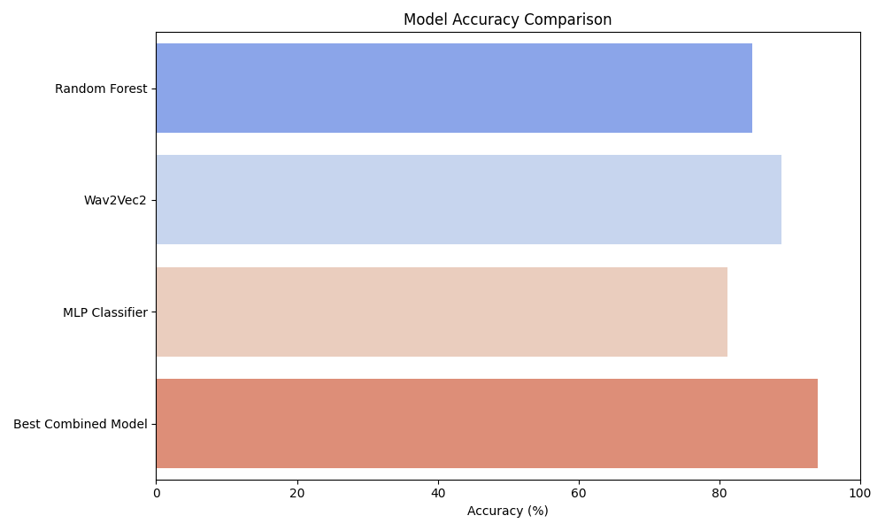
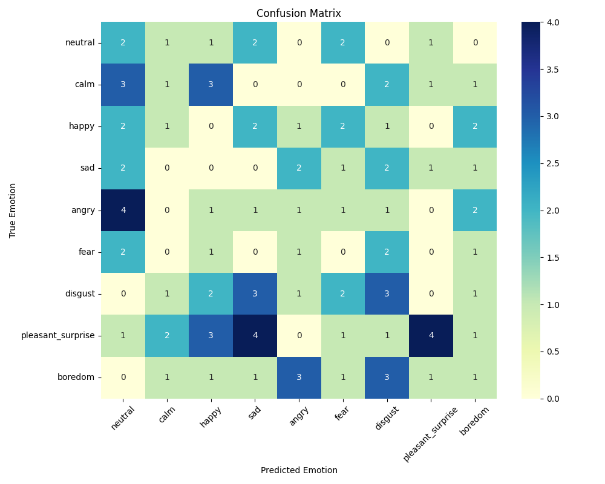

# 🎤 Speech Emotion Recognition

A machine learning and deep learning-based system for recognizing emotions from speech using audio features like MFCCs, Spectrograms, and more.

## 📌 Overview

This project implements a Speech Emotion Recognition (SER) pipeline that uses audio signal processing and classification algorithms to detect emotions from speech. It supports multiple datasets, feature extractors, classifiers, and evaluation metrics.

---

## 🧠 Supported Emotions

- Neutral
- Calm
- Happy
- Sad
- Angry
- Fearful
- Disgust
- Pleasant Surprise
- Boredom

---

## 🛠️ Features

- 🔉 Extracts audio features (MFCC, Chromagram, Spectrogram, etc.)
- 🤖 Classifiers: SVC, RandomForest, GradientBoosting, KNeighbors, MLP, RNN
- 🧪 Hyperparameter tuning via GridSearchCV
- 📊 Evaluation: Accuracy, Confusion Matrix
- 💾 Model saving & loading (`.pkl`)
- 🔍 Dataset support: RAVDESS, TESS, EMO-DB, Custom

---

## 📦 Tech Stack

| Domain | Tools |
|--------|-------|
| Programming | Python |
| Audio Processing | Librosa, OpenSMILE |
| Machine Learning | Scikit-learn |
| Deep Learning | PyTorch, HuggingFace Transformers (Wav2Vec2) |
| Deployment (Optional) | Firebase Functions, Streamlit, Gradio |

---

## 📁 Project Structure

```bash
speech-emotion-recognition/
├── data/                         # Raw and processed audio files, organized by dataset
│   ├── RAVDESS/
│   ├── TESS/
│   ├── CREMA-D/
│   └── custom/                   # Your own audio recordings
│
├── models/                       # Trained models & preprocessed data
│   ├── final_model.pkl
│   ├── scaler.pkl
│   ├── label_encoder.pkl
│   ├── tess-model.pkl
│   └── tess-label-encoder.pkl    # Any .joblib or .pt files
│
├── results/                      # Visual outputs
│   ├── confusion_matrix.png
│   ├── model_accuracy_comparison.png
│
├── src/                          # Source code
│   └──features.py                # Feature extraction scripts
├── train_final_model.py          # Training & evaluation logic
├── app.py                        # Streamlit-based app to demo emotion predictions
├── .gitattributes                # Optional: Git LFS or text encoding rules
├── CITATION.cff                  # Software citation metadata (you-only version)
├── LICENSE                       # MIT License (under your name)
├── README.md                     # Main project overview and usage
├── requirements.txt              # Python dependencies
├── streamlit_app.py              # App interface for demo/testing
├── plot_benchmarks.py            # Script to generate accuracy and confusion matrix plots
```

---

## 🚀 Getting Started

1. Clone the repo

git clone https://github.com/chirgamiyy/speech-emotion-recognition.git
cd speech-emotion-recognition

2. Install dependencies
   
pip install -r requirements.txt

3. Run training or prediction
   
python src/train.py        # Train model
python src/predict.py      # Predict emotion from audio

---

## 📊 Example Results

### 🔹 Model Accuracy Comparison (93.96%)


### 🔹 Confusion Matrix (on Combined Dataset)


---

## 📜 License

This project is licensed under the [MIT License](./LICENSE).

---

## 🙌 Acknowledgements
  
- **Audio Datasets**:
  - [RAVDESS on Kaggle](https://www.kaggle.com/datasets/uwrfkaggler/ravdess-emotional-speech-audio)
  - [TESS on Kaggle](https://www.kaggle.com/datasets/ejlok1/toronto-emotional-speech-set-tess)
  - [CREMA-D on Kaggle](https://www.kaggle.com/datasets/ejlok1/cremad)

- **Feature Extraction Libraries**:
  - [Librosa](https://librosa.org/)
  - [OpenSMILE Toolkit](https://audeering.github.io/opensmile/)

- **Machine Learning & Deep Learning**:
  - [Scikit-learn](https://scikit-learn.org/)
  - [PyTorch](https://pytorch.org/)
  - [HuggingFace Transformers](https://huggingface.co/)

> If you build upon this work, please consider citing it via the [`CITATION.cff`](./CITATION.cff) file.

---

## 📚 Citation

If you use this work, please cite it using the metadata in [`CITATION.cff`](./CITATION.cff).

```bibtex
@software{agrawal_2025_ser,
  author = {Chirag Agrawal},
  title = {Speech Emotion Recognition},
  year = {2025},
  version = {1.0.0},
  url = {https://github.com/chirgamiyy/speech-emotion-recognition}
}
```
Feel free to ⭐ the repo if you found it helpful!
